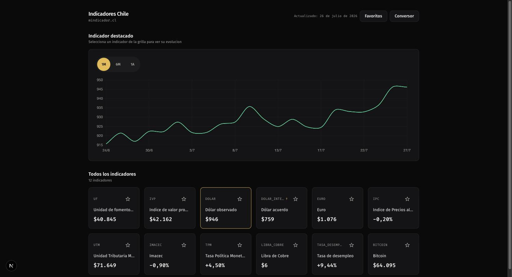

# Pulso — Dashboard de indicadores económicos de Chile


Dashboard que consume la API pública de [mindicador.cl](https://mindicador.cl) para mostrar en tiempo (casi) real los 12 indicadores económicos de Chile: UF, dólar, euro, IPC, UTM, IMACEC, TPM, libra de cobre, tasa de desempleo, bitcoin, IVP y dólar acuerdo. Incluye gráfico histórico por indicador, favoritos persistentes y un conversor de monto entre CLP y cualquier indicador.



## Stack

- [Next.js 16](https://nextjs.org) (App Router, Turbopack) + React 19 + TypeScript
- Tailwind CSS 4
- [SWR](https://swr.vercel.app) para fetching y revalidación en el cliente
- Chart.js / react-chartjs-2 para el histórico
- Vitest + Testing Library (unitarios/componentes), Playwright (E2E)

## Cómo correrlo localmente

Requisitos: Node 26+, npm.

```bash
npm install
cp .env.example .env.local
npm run dev
```

Completar `.env.local` con `BCENTRAL_USER`/`BCENTRAL_PASS` — credenciales de la API SI3 del Banco Central de Chile (requiere registro en [si3.bcentral.cl](https://si3.bcentral.cl)). Son server-only: se leen únicamente en Route Handlers/lib del lado del servidor, nunca en componentes cliente.

Abrir [http://localhost:3000](http://localhost:3000).

Otros scripts disponibles:

| Script                 | Qué hace                             |
| ---------------------- | ------------------------------------ |
| `npm run build`        | Build de producción                  |
| `npm run start`        | Sirve el build de producción         |
| `npm run lint`         | ESLint                               |
| `npm run format`       | Formatea con Prettier                |
| `npm run format:check` | Verifica formato sin escribir        |
| `npm run test`         | Tests unitarios/componentes (Vitest) |
| `npm run test:watch`   | Vitest en modo watch                 |
| `npm run test:e2e`     | Tests E2E (Playwright)               |

## Arquitectura

```
app/
  page.tsx                              → home, renderiza DashboardHome
  api/indicadores/route.ts              → GET snapshot de los 12 indicadores
  api/indicadores/[codigo]/[anio]/      → GET histórico anual de un indicador
  dev/ui/                                → catálogo interno de componentes (solo en dev, bloqueado en prod)
components/                             → DashboardHome, IndicatorCard, HistoryChart, Converter, etc.
hooks/                                  → useIndicadores, useIndicadorHistory, useFavoritos
lib/mindicador-client.ts                → cliente HTTP hacia mindicador.cl (timeout, manejo de errores)
types/indicador.ts                      → tipos y los 12 códigos de indicador soportados
```

La app nunca llama a `mindicador.cl` desde el navegador: los componentes cliente consumen `/api/indicadores*` vía SWR, y esos Route Handlers son los que hacen el `fetch` server-side hacia mindicador.cl (con cache/`revalidate` de Next.js y un fallback al último snapshot bueno si la API externa falla).

`proxy.ts` bloquea `/dev/ui` en producción (devuelve 404), ya que es una ruta de desarrollo interna.

### Particularidades de los datos de mindicador.cl

No todos los indicadores se actualizan igual — esto afecta cómo se calculan rangos y variaciones en `HistoryChart`/`useIndicadorHistory`:

- **Diarios**: `uf`, `ivp`
- **Diarios hábiles** (solo días de mercado): `dolar`, `euro`, `libra_cobre`, `tpm`
- **Semanal aprox.**: `bitcoin` (~52 puntos/año pese a ser un mercado 24/7)
- **Mensuales**: `ipc`, `utm`, `imacec`, `tasa_desempleo`
- **Descontinuado**: `dolar_intercambio` — sin datos reales desde 2014-11-13

## Testing

- **Unitarios/componentes** (`npm run test`): Vitest + Testing Library, cubren hooks, componentes de UI y los Route Handlers.
- **E2E** (`npm run test:e2e`): Playwright contra el build de producción (`playwright.config.ts` levanta `next build && next start` automáticamente). Los mocks de red interceptan las rutas propias de la app (`/api/indicadores*`), no `mindicador.cl`, para que los tests no dependan de la API externa.

## Git hooks

Este repo usa [Husky](https://typicode.github.io/husky/) y [lint-staged](https://github.com/lint-staged/lint-staged) para correr ESLint y Prettier sobre los archivos staged antes de cada commit. Si el hook reporta errores, hay que corregirlos antes de commitear — ese es el camino esperado.

En casos excepcionales (ej. un commit WIP en una rama local) se puede saltar el hook con:

```bash
git commit --no-verify
```

Usar esto con moderación — código que se pushea sin pasar lint/format puede fallar en CI o ser marcado en la revisión.

## CI/CD

Cada Pull Request hacia `main` corre un workflow de GitHub Actions (`.github/workflows/ci.yml`) con jobs separados de **lint**, **type-check**, **tests unitarios**, **tests E2E** y **build**, con cache de dependencias npm. Cualquier fallo bloquea la PR.

El deploy en [Vercel](https://vercel.com) (preview por PR y producción en `main`) está planificado como próximo paso del proyecto.
