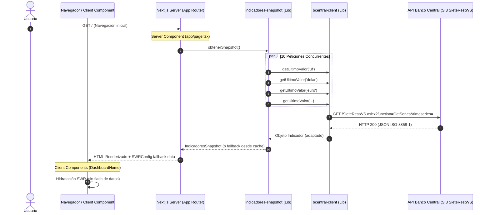

# Documentación Técnica Interna — Proyecto Pulso

Bienvenido a la documentación oficial del sistema **Pulso**, el panel de control de indicadores económicos de Chile en tiempo real desarrollado sobre **Next.js 16 (App Router)**, **React 19**, **TypeScript** y **TailwindCSS v4**.

Este conjunto de documentos constituye la especificación de arquitectura, diseño técnico y funcionamiento interno orientada a ingenieros de software, arquitectos y mantenedores del sistema.

---

## 🏛️ Por qué elegimos esta estructura de documentación

La documentación ha sido estructurada en archivos Markdown independientes dentro del directorio `docs/`, complementada con documentación granular por carpeta en `docs/code/` y comentarios JSDoc directamente en el código fuente.

### Justificación de Diseño:

1. **Navegabilidad y Mantenibilidad**: Evitamos un único archivo monolítico inviable de mantener. Cada dominio de arquitectura (Rutas, Estado, Servicios, API, Deuda Técnica, etc.) posee su propio documento enfocado.
2. **Convención Estándar del Ecosistema TypeScript / Next.js**: Organizada respetando la estructura física del proyecto `app/`, `components/`, `hooks/`, `lib/`, `types/`, facilitando el mapeo mental entre la lectura teórica y la inspección del código.
3. **Documentación a Dos Niveles**:
   - **Nivel Sistema / Arquitectura (`docs/*.md`)**: Explica las decisiones de alto nivel, patrones de diseño, flujos de datos integrales y modelos conceptuales.
   - **Nivel Código Fuente (`docs/code/*.md` y JSDoc en `.ts/.tsx`)**: Documenta exhaustivamente cada archivo, componente, interfaz y función con firmas, algoritmos, casos borde y diagramas de flujo.

---

## 📚 Índice General de Navegación

### 1. Documentación de Arquitectura y Sistema

- 🏗️ [Arquitectura y Decisiones de Diseño](architecture.md) — Visión general, migración a Banco Central SI3, resiliencia y patrón Adapter.
- 📋 [Resumen del Proyecto y Objetivos](project-overview.md) — Propósito del producto, requerimientos no funcionales y alcance.
- 📂 [Estructura de Carpetas](folder-structure.md) — Árbol del proyecto, responsabilidades y mapa de dependencias.
- 🛣️ [Rutas de la Aplicación (App Router)](routes.md) — Mapeo de rutas públicas, endpoints internos y middlewares.
- 🧩 [Componentes React](components.md) — Sistema de diseño y especificación técnica de la UI.
- ⚓ [Custom Hooks](hooks.md) — hooks de datos (`useIndicadores`, `useIndicadorHistory`) y estado (`useFavoritos`).
- 🛠️ [Servicios y Clientes Backend](services.md) — Cliente HTTP del Banco Central de Chile y motor de snapshot.
- 🔌 [Endpoints de API Interna](api.md) — Documentación de Route Handlers `/api/indicadores`.
- 💾 [Estrategia de Datos y Caché](database.md) — In-memory caching, ISR, Data Cache y localStorage.
- 🔐 [Autenticación y Seguridad](authentication.md) — Modelo de acceso público, secretos de API y Dev Proxy guard.
- 🔄 [Gestión del Estado](state-management.md) — Hydration con SWR, External Store Observer y estado local.
- 🌐 [Variables de Entorno y Configuración](environment.md) — Variables requeridas, tsconfig, Tailwind v4 y herramientas.
- 📦 [Análisis de Dependencias](dependencies.md) — Desglose de librerías del runtime y desarrollo en `package.json`.
- 📐 [Patrones de Diseño Identificados](patterns.md) — Adapter, Resilient Cache with Fallback, Observer, SSR Hydration.
- ⚠️ [Deuda Técnica y Diagnóstico](technical-debt.md) — Puntos de riesgo, acoplamientos y optimizaciones recomendadas.
- 🗺️ [Roadmap Técnico](roadmap.md) — Propuestas futuras de escalabilidad y mejoras UI.
- 📖 [Glosario](glossary.md) — Términos del dominio económico chileno y jerga técnica.

---

### 2. Documentación Granular de Código Fuente (`docs/code/`)

- 📄 [Carpeta App (`docs/code/app.md`)](code/app.md) — Páginas, layouts, metadata y route handlers.
- 📄 [Carpeta Components (`docs/code/components.md`)](code/components.md) — Todos los componentes UI.
- 📄 [Carpeta Hooks (`docs/code/hooks.md`)](code/hooks.md) — Todos los custom hooks.
- 📄 [Carpeta Lib (`docs/code/lib.md`)](code/lib.md) — Cliente de API, snapshot engine y formateadores.
- 📄 [Carpeta Types (`docs/code/types.md`)](code/types.md) — Definiciones TypeScript del dominio.
- 📄 [Archivos Raíz y Configuración (`docs/code/root.md`)](code/root.md) — `proxy.ts`, configs de build, linting y testing.

---

## ⚡ Diagrama de Flujo General del Sistema

El siguiente diagrama resume cómo fluye la información desde la petición del usuario hasta la consulta externa al Banco Central de Chile:

