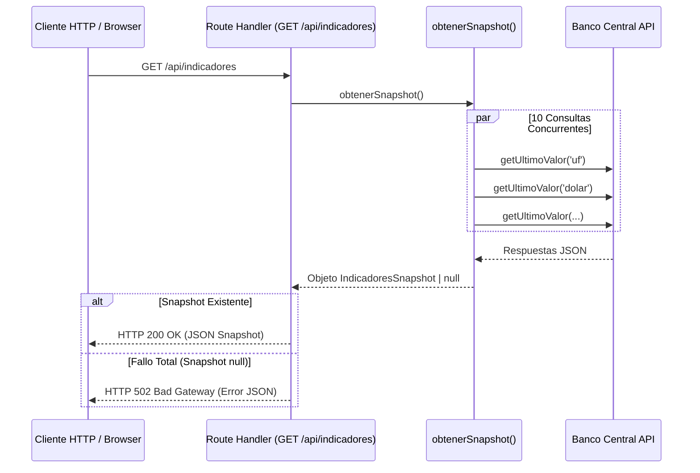

# Especificación de la API Interna (Route Handlers)

Este documento contiene la especificación de API para los endpoints expuestos por los Route Handlers de **Pulso** bajo la ruta `/api/`.

---

## 📡 Endpoint 1: Obtenedor de Snapshot Global

### `GET /api/indicadores`

#### Propósito:

Devuelve una fotografía (snapshot) con los valores más recientes de los 10 indicadores económicos soportados.

#### Firma del Handler:

```typescript
export async function GET(): Promise<NextResponse>;
```

#### Modificadores de Caché Next.js:

- `export const dynamic = 'force-static'`: Fuerza al compilador de Next.js a tratar la respuesta de este handler como estática dentro del Data Cache.
- `export const revalidate = 300`: Indica un periodo de revalidación en segundo plano (ISR) de 300 segundos (5 minutos).

#### Diagrama de Secuencia Interno:



#### Respuestas HTTP:

##### HTTP 200 OK:

```json
{
  "version": "2.0",
  "autor": "Banco Central de Chile",
  "fecha": "2026-07-27T17:19:29.000Z",
  "uf": {
    "codigo": "uf",
    "nombre": "Unidad de fomento (UF)",
    "unidad_medida": "Pesos",
    "fecha": "2026-07-27T04:00:00.000Z",
    "valor": 39412.87
  },
  "dolar": {
    "codigo": "dolar",
    "nombre": "Dólar observado",
    "unidad_medida": "Pesos",
    "fecha": "2026-07-25T04:00:00.000Z",
    "valor": 963.12
  }
}
```

##### HTTP 502 Bad Gateway:

```json
{
  "error": "No se pudo obtener ningun indicador desde el Banco Central"
}
```

---

## 📡 Endpoint 2: Obtenedor de Serie Histórica por Año

### `GET /api/indicadores/[codigo]/[anio]`

#### Propósito:

Devuelve el desglose de observaciones de la serie histórica de un indicador específico durante un año calendario determinado.

#### Parámetros de URL:

- `codigo`: `string` — Identificador del indicador (ej: `'uf'`, `'dolar'`, `'ipc'`).
- `anio`: `string` — Año numérico de 4 dígitos (ej: `'2026'`).

#### Validaciones y Códigos de Error:

1. **Código Inexistente**:
   Si `codigo` no está en la lista inmutable `INDICADOR_CODIGOS`:
   - Status: `HTTP 400 Bad Request`
   - Body:

   ```json
   {
     "error": "codigo invalido: bitcoin. Valores soportados: uf, ivp, dolar, euro, ipc, utm, imacec, tpm, libra_cobre, tasa_desempleo"
   }
   ```

2. **Año Formato/Rango Inválido**:
   Si `anio` no son 4 dígitos o es menor a 1970 o mayor al año actual:
   - Status: `HTTP 400 Bad Request`
   - Body:

   ```json
   {
     "error": "anio invalido: 1850. Debe ser un numero de 4 digitos entre 1970 y 2026"
   }
   ```

3. **Fallo en API Externa**:
   Si el Banco Central de Chile rechaza la consulta o vence el timeout:
   - Status: `HTTP 502 Bad Gateway`
   - Body:
   ```json
   {
     "error": "Banco Central fallo para dolar: Tiempo de espera agotado al consultar la serie F073.TCO.PRE.Z.D"
   }
   ```

#### Respuesta de Éxito (HTTP 200 OK):

```json
{
  "codigo": "uf",
  "nombre": "Unidad de fomento (UF)",
  "unidad_medida": "Pesos",
  "serie": [
    {
      "fecha": "2026-01-01T00:00:00.000Z",
      "valor": 39350.1
    },
    {
      "fecha": "2026-01-02T00:00:00.000Z",
      "valor": 39352.45
    }
  ]
}
```
