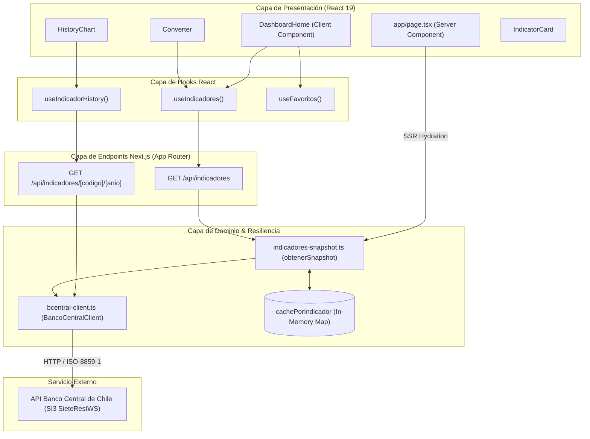

# Arquitectura del Sistema y Decisiones de Diseño

Este documento describe la arquitectura técnica de **Pulso**, explicando las decisiones de diseño fundamentales, la evolución desde servicios externos legacy hacia la API oficial del **Banco Central de Chile**, y los patrones de tolerancia a fallos implementados.

---

## 📐 Visión de Arquitectura

**Pulso** adopta una arquitectura modular basada en **Next.js 16 (App Router)** utilizando una separación clara entre:

1. **Capa de Dominio y Tipos (`types/`)**: Define la estructura inmutable de los datos de indicadores (`Indicador`, `IndicadoresSnapshot`, `SerieHistorica`).
2. **Capa de Integración Externa y Adaptadores (`lib/`)**: Encapsula el acceso HTTP a la API externa del Banco Central (`bcentral-client.ts`), realiza la decodificación binaria de juegos de caracteres legacy (`ISO-8859-1`), y mantiene el caché estático de resiliencia (`indicadores-snapshot.ts`).
3. **Capa de API Proxy Interna (`app/api/`)**: Expone Route Handlers normalizados (`/api/indicadores` y `/api/indicadores/[codigo]/[anio]`) configurados con generación estática/ISR (`revalidate = 300`).
4. **Capa de Gestión de Estado y Hooks (`hooks/`)**: Provee hooks reactivos para hidratación en el cliente mediante SWR (`useIndicadores`, `useIndicadorHistory`) y sincronización de preferencias del usuario mediante `useSyncExternalStore` (`useFavoritos`).
5. **Capa de Interfaz de Usuario (`components/` y `app/`)**: Componentes de React 19 optimizados con TailwindCSS v4 y animación mediante Canvas/Chart.js para visualización de gráficos.



---

## 🔄 Migración de mindicador.cl a Banco Central (SI3 SieteRestWS)

### 1. El Problema Original

La aplicación dependía originalmente de `mindicador.cl`. Debido a problemas severos de disponibilidad e intermitencias en dicho servicio público, se decidió migrar la fuente de datos a la API oficial del **Banco Central de Chile (SI3 / SieteRestWS)**.

### 2. Desafíos de Integración Técnicos

La API del Banco Central de Chile presenta características particulares que requirieron decisiones de diseño específicas:

| Desafío en Banco Central                             | Solución Arquitectónica Implementada                                                                                                                                                                                                                                        |
| ---------------------------------------------------- | --------------------------------------------------------------------------------------------------------------------------------------------------------------------------------------------------------------------------------------------------------------------------- |
| **1 llamada por serie (vs 1 llamada global)**        | Se migró el snapshot de 1 request a **10 requests en paralelo** usando `Promise.all`. Las pruebas demostraron que 10 llamadas concurrentes responden en ~0.23s sin activar rate limits.                                                                                     |
| **Respuesta en codificación `ISO-8859-1` (Latin-1)** | Fetch API decodifica JSON como `UTF-8` por defecto, corrompiendo caracteres como tildes o la "ñ" en `dólar`. Se implementó lectura de `ArrayBuffer` crudo y decodificación explícita con `new TextDecoder('iso-8859-1')`.                                                   |
| **Códigos HTTP siempre 200**                         | La API del Banco Central retorna status HTTP `200` aun en situaciones de error (credenciales inválidas, serie inexistente), reportando fallos en el cuerpo JSON (`Codigo !== 0`). Se creó la clase `BancoCentralApiError` para inspeccionar el cuerpo y lanzar excepciones. |
| **Formatos de fecha no estándar**                    | Las respuestas devuelven fechas en formato `DD-MM-YYYY`. Se creó un parser personalizado (`parseFechaBanco`) para convertir las cadenas a estándares ISO 8601 UTC.                                                                                                          |
| **Días sin mercado y relleno de datos**              | Indicadores financieros (dólar, euro) marcan días hábiles/fines de semana con `statusCode: "ND"` o los omiten. Se filtra estrictamente por `statusCode === "OK"`.                                                                                                           |

---

## 🛡️ Patrón de Resiliencia: Fallback Por Indicador

Dado que la obtención de datos requiere 10 llamadas independientes al Banco Central, un fallo parcial (por ejemplo, timeout en la serie del IPC) no debe romper la visualización de los otros 9 indicadores ni tirar abajo toda la aplicación.

### Estrategia de Caché Individual:

```typescript
const cachePorIndicador = new Map<IndicadorCodigo, Indicador>();
```

1. **Consulta Individual con Catch In-line**: Cada indicador se consulta de forma independiente dentro de `obtenerConFallback(codigo)`.
2. **Actualización Selectiva**: Si la llamada a `getUltimoValor(codigo)` tiene éxito, actualiza el valor en `cachePorIndicador` y lo retorna.
3. **Graceful Degradation**: Si la llamada falla (error de red, timeout de 8s o error del Banco Central), se captura la excepción, se registra el error en consola y se devuelve el último valor válido almacenado en el `Map` en memoria.
4. **Fallo Total**: Si un indicador nunca pudo ser consultado (arranque en frío) y la API falla, la clave quedará `undefined`. Si **todos** los 10 indicadores fallan y no hay caché, la función `obtenerSnapshot()` retorna `null`, permitiendo al Route Handler devolver un código HTTP `502 Bad Gateway`.

---

## ⚡ Patrón de Hidratación de Estado en SSR con SWR

Para prevenir el molesto "flash de esqueleto de carga" (Layout Shift) al recargar la página en el cliente, la aplicación utiliza una estrategia de hidratación isomórfica:

1. **Server Component (`app/page.tsx`)**: Ejecuta `obtenerSnapshot()` durante el renderizado en el servidor.
2. **Inyección en SWR (`<SWRConfig fallback={...}>`)**: Encapsula el Client Component `<DashboardHome />` inyectando el snapshot inicial bajo la clave `/api/indicadores`.
3. **Hydration en Cliente**: Cuando React se hidrata en el navegador, `useIndicadores()` lee inmediatamente del caché de SWR inyectado en el render inicial sin disparar un loader, e inicia la revalidación en segundo plano (`isValidating`).

---

## 🔐 Middleware Dev Proxy Security Guard

En el directorio `/app/dev/ui`, existe una página de demostración de componentes UI (Storybook liviano). Para evitar que esta ruta sea expuesta en entornos de producción:

1. El archivo `proxy.ts` exporta una función middleware matcher `/dev/ui`.
2. Si `process.env.NODE_ENV === 'production'`, el proxy intercepta la petición y retorna una respuesta `NextResponse` con status `404 Not Found`.
3. Adicionalmente, el Server Component en `app/dev/ui/page.tsx` invoca `notFound()` como mecanismo de defensa en profundidad.
