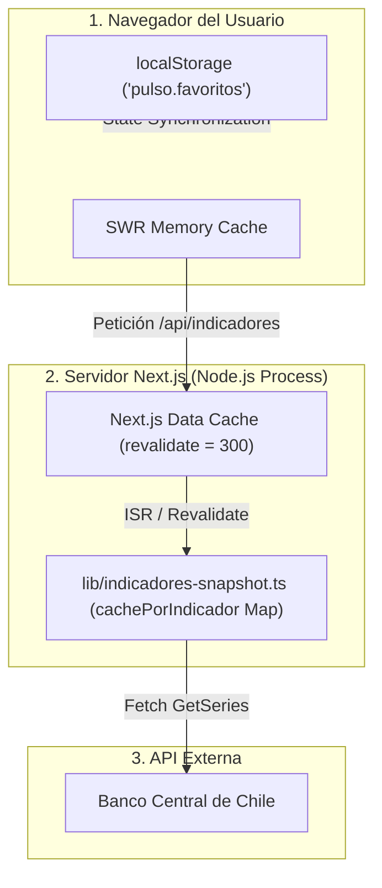

# Estrategia de Almacenamiento y Caché de Datos

Este documento describe la arquitectura de almacenamiento, persistencia y cachés utilizada por la aplicación **Pulso**.

---

## 💾 Ausencia de Base de Datos Tradicional

El proyecto **Pulso** no utiliza una base de datos relacional (PostgreSQL, MySQL) ni NoSQL (MongoDB, Redis) persistida en disco. La aplicación funciona como un **proxy inteligente con resiliencia en memoria** frente a la API del Banco Central de Chile.

---

## 🗄️ Capas de Caché del Sistema

La arquitectura implementa tres niveles de caché complementarios:

### 1. Caché en Memoria Volátil del Proceso (`cachePorIndicador`)

- **Ubicación**: `lib/indicadores-snapshot.ts`
- **Mecanismo**: `const cachePorIndicador = new Map<IndicadorCodigo, Indicador>()`
- **Propósito**: Mantiene el último valor exitoso conocido para cada uno de los 10 indicadores de forma independiente.
- **Tolerancia a Fallos**: Si la API del Banco Central experimenta una caída momentánea en la serie de un indicador, el sistema sirve el valor almacenado en este `Map` en lugar de responder con un error.

### 2. Next.js Data Cache & Incremental Static Regeneration (ISR)

- **Ubicación**: Route Handlers (`app/api/indicadores/route.ts` y `.../[codigo]/[anio]/route.ts`) y `lib/bcentral-client.ts`.
- **Mecanismo**: `export const dynamic = 'force-static'`, `export const revalidate = 300` y `{ next: { revalidate: 300 } }` en las llamadas `fetch`.
- **Propósito**: Garantizar que el servidor de Next.js almacene en caché las respuestas durante 5 minutos (300 segundos), reduciendo drásticamente la carga de peticiones sobre la infraestructura pública del Banco Central.

### 3. Almacenamiento Local del Cliente (`localStorage`)

- **Ubicación**: Navegador web del cliente.
- **Clave**: `'pulso.favoritos'`
- **Formato**: Arreglo JSON serializado (ej: `["uf", "dolar"]`).
- **Propósito**: Persistir la selección de indicadores preferidos del usuario entre sesiones de navegación sin requerir una cuenta de usuario o base de datos en servidor.
