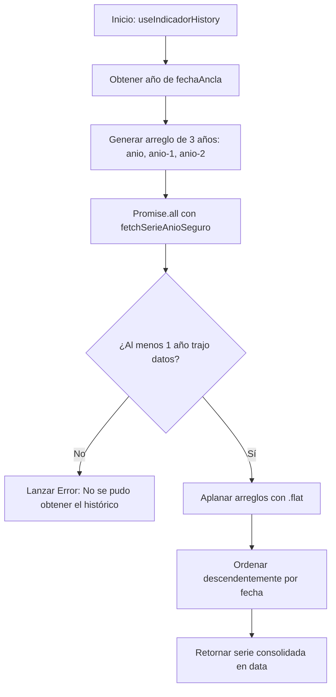

# Custom React Hooks

Este documento especifica la implementación y comportamiento de los custom hooks desarrollados para **Pulso**.

---

## ⚓ `useIndicadores`

- **Archivo**: `hooks/useIndicadores.ts`
- **Propósito**: Consumir la fotografía actual de todos los indicadores desde el endpoint `/api/indicadores` con soporte de caché reactivo y deduplicación.

### Firma:

```typescript
export function useIndicadores(): {
  data: IndicadoresSnapshot | undefined;
  isLoading: boolean;
  isValidating: boolean;
  error: Error | undefined;
};
```

### Configuración SWR:

- **Endpoint Key**: `ENDPOINT_INDICADORES = '/api/indicadores'`
- **`revalidateOnFocus`**: `true` (Revalida automáticamente cuando el usuario regresa a la pestaña).
- **`dedupingInterval`**: `60_000` ms (Evita peticiones duplicadas durante 1 minuto).

### Flujo Interno:

1. Invoca `useSWR(ENDPOINT_INDICADORES, fetcher)`.
2. El `fetcher` realiza un `fetch('/api/indicadores')` y valida `response.ok`. Si el servidor responde con status de error (ej: 502), extrae el JSON de error y lanza una excepción.
3. Retorna `{ data, isLoading, isValidating, error }`.

---

## ⚓ `useIndicadorHistory`

- **Archivo**: `hooks/useIndicadorHistory.ts`
- **Propósito**: Cargar y consolidar la serie histórica de un indicador a lo largo de un rango de hasta 3 años calendario.

### Firma:

```typescript
export function useIndicadorHistory(
  codigo: IndicadorCodigo,
  fechaAncla: Date,
): {
  data: SerieHistoricaPunto[] | undefined;
  isLoading: boolean;
  isValidating: boolean;
  error: Error | undefined;
};
```

### Por qué existe la carga multianual:

El selector de historial de la UI permite ver hasta 24 meses hacia atrás (`2A`). Un rango de 24 meses a contar de la `fechaAncla` (ej: Enero 2026) abarca 3 años calendario diferentes (2026, 2025 y 2024). Puesto que la API interna expone datos por año (`/api/indicadores/[codigo]/[anio]`), el hook consulta concurrentemente el año de la fecha ancla y los 2 años anteriores (`ANIOS_HACIA_ATRAS = 2`).

### Flujo Interno:



### Tolerancia a Fallos Interna (`fetchSerieAnioSeguro`):

Si la petición para un año específico falla (por ejemplo, el indicador no existía en 1970 o hubo un error puntual), `fetchSerieAnioSeguro` captura el error silenciosamente y retorna un arreglo vacío `[]` para no cancelar las respuestas válidas de los otros años.

---

## ⚓ `useFavoritos`

- **Archivo**: `hooks/useFavoritos.ts`
- **Propósito**: Gestionar la lista de indicadores marcados como favoritos por el usuario, manteniéndola persistida en `localStorage` y sincronizada en tiempo real entre múltiples pestañas del navegador.

### Firma:

```typescript
export function useFavoritos(): {
  favoritos: IndicadorCodigo[];
  toggleFavorito: (codigo: IndicadorCodigo) => void;
  esFavorito: (codigo: IndicadorCodigo) => boolean;
};
```

### Por qué usa `useSyncExternalStore`:

El uso tradicional de `localStorage` mediante `useState` y `useEffect` causa problemas de **Hydration Mismatch** en Next.js (el servidor renderiza HTML sin favoritos, y el cliente re-renderiza tras la hidratación causando un salto visual).

Al utilizar `useSyncExternalStore`:

1. **Server Snapshot (`getServerSnapshot`)**: Devuelve un arreglo vacío constante (`[]`) durante el SSR.
2. **Client Snapshot (`getSnapshot`)**: Lee de un caché en memoria respaldado por `localStorage`.
3. **Suscripción (`subscribe`)**: Escucha eventos nativos `storage` del objeto `window`. Si el usuario marca un favorito en una pestaña, todas las demás pestañas abiertas actualizan su interfaz instantáneamente.

### Métodos Exportados:

- **`toggleFavorito(codigo)`**: Agrega el código si no existe, o lo remueve si ya estaba presente, actualizando el almacenamiento y notificando a los suscriptores.
- **`esFavorito(codigo)`**: Función memorizada con `useCallback` que retorna un booleano indicando si el código está en la lista.
