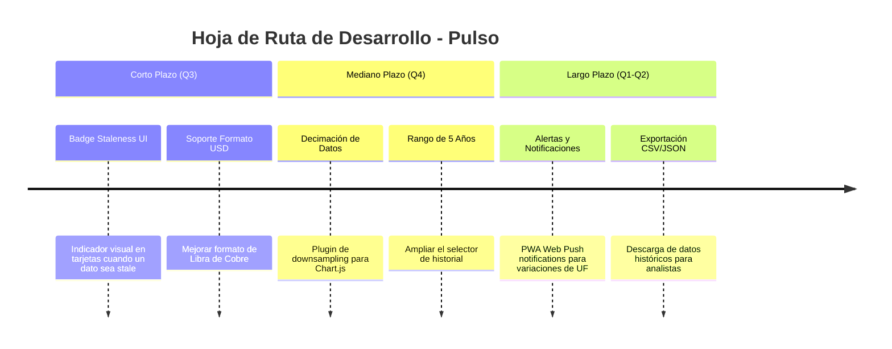

# Roadmap Técnico y Futuras Mejoras

Este documento presenta una hoja de ruta con propuestas de evolución técnica y nuevas funcionalidades sugeridas para **Pulso**.

---

## 🗺️ Roadmap de Evolución

---

## 🚀 Propuestas Detalladas

### 1. Distinción Visual de Datos Stale/Cacheados (Corto Plazo)

- **Objetivo**: Si un indicador específico falla en la API del Banco Central y se sirve el valor de fallback del caché, agregar una insignia visual discreta (ej: badge "Dato en caché") en la `IndicatorCard` para brindar transparencia al usuario.

### 2. Formato Multimoneda Explícito (Corto Plazo)

- **Objetivo**: Modificar `lib/format.ts` para que `formatValorPorUnidad` soporte formatear de manera nativa la unidad de medida `'Dolar'` (para la Libra de Cobre) utilizando `Intl.NumberFormat('en-US', { style: 'currency', currency: 'USD' })`.

### 3. Ampliación del Selector de Historial a 5 Años (`5A`) (Mediano Plazo)

- **Objetivo**: Permitir a los usuarios analizar tendencias macroeconómicas de largo plazo.
- **Requerimiento Técnico**: Implementar reducción de puntos en el servidor o cliente mediante `chartjs-plugin-decimation` para mantener la fluidez del gráfico sin sobrecargar la memoria del navegador.

### 4. Modo PWA y Notificaciones (Largo Plazo)

- **Objetivo**: Convertir Pulso en una Progressive Web App (PWA) instalable en teléfonos móviles y escritorios, añadiendo notificaciones Push cuando la UF sufra reajustes o el Dólar supere umbrales configurables.
