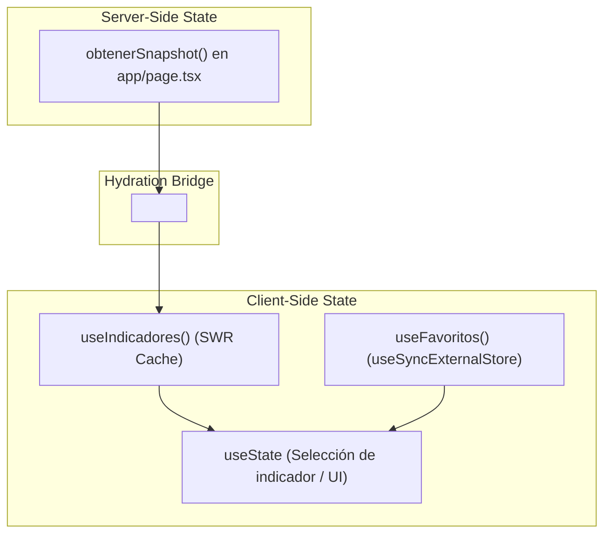

# Gestión del Estado

Este documento explica cómo fluye el estado de la información a lo largo de la aplicación **Pulso**, detallando el manejo de datos remotos, el estado local y la sincronización con almacenamiento en cliente.

---

## 🔄 Flujo de Estado Global y Servidor-Cliente

La aplicación no utiliza librerías de estado global pesado como Redux o Zustand. En su lugar, el estado se administra mediante tres patrones ligeros especializados:

---

## 1. Estado de Datos Remotos (SWR Engine)

- **Implementación**: `useSWR` en `hooks/useIndicadores.ts` y `hooks/useIndicadorHistory.ts`.
- **Estrategia**:
  - **Server-Side Injection**: El servidor Next.js ejecuta la consulta durante el SSR y la pasa a `<SWRConfig>` mediante la propiedad `fallback`.
  - **Cliente**: `useSWR` lee del caché de hidratación. No dispara peticiones duplicadas gracias a `dedupingInterval: 60000` y realiza revalidación en segundo plano cuando la ventana recupera el foco (`revalidateOnFocus: true`).

---

## 2. Estado de Preferencias del Usuario (`useSyncExternalStore`)

- **Implementación**: `hooks/useFavoritos.ts`.
- **Patrón**: Observer Pattern sobre `localStorage` de la Web API.
- **Ventajas**:
  - Garantiza **seguridad de renderizado isomórfico** sin discrepancias de hidratación en React 19.
  - Sincroniza en tiempo real entre múltiples pestañas del navegador abiertas usando la escucha del evento nativo `window.addEventListener('storage', ...)`.

---

## 3. Estado Local de Componente (`useState` & `useMemo`)

- **Ubicación**: Principalmente en `DashboardHome.tsx`, `Converter.tsx` y `HistoryChart.tsx`.
- **Casos de Uso**:
  - `indicadorSeleccionado`: Guarda qué indicador se está visualizando activamente en el gráfico.
  - `soloFavoritos`: Booleano que conmuta la visibilidad de la grilla principal.
  - `mostrarConversor`: Booleano para desplegar u ocultar la sección del conversor.
  - `montoTexto` / `direccion`: Valores de entrada del formulario en el conversor.
